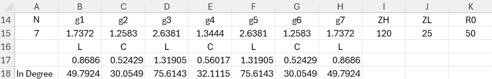
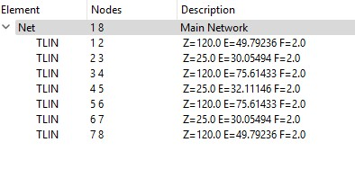
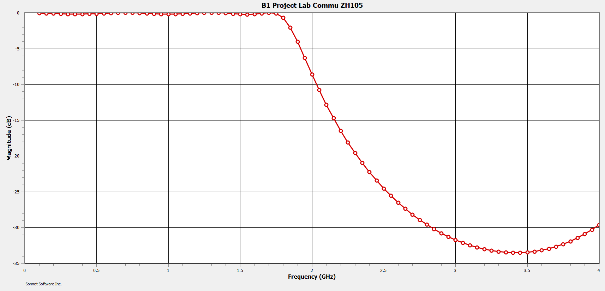
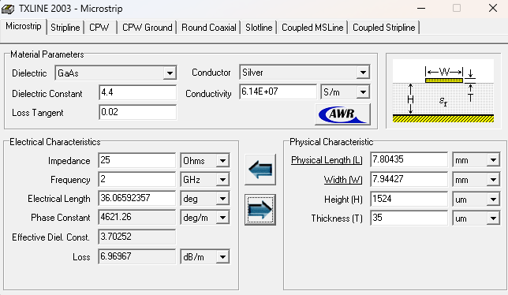
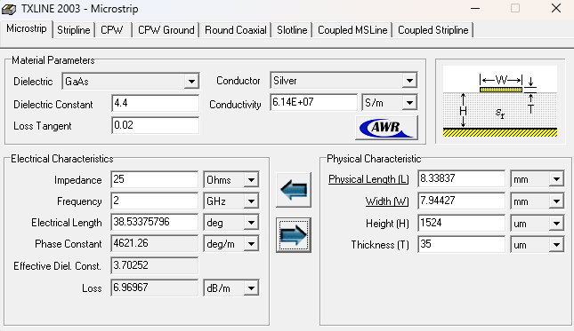
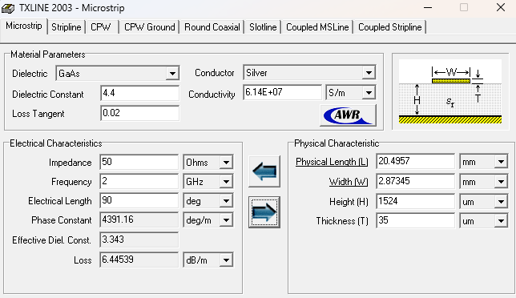

## Design Low Pass Filter

by using frequency cutoff at 2 GHz and attenuation 3 GHz > 30 dB.

#### We chosse 0.5 dB ripple Table

We get abs(W/Wc) - 1 = 0.5 and then we gonna get N = 7

#### Calculate L and C from g 7-order that we got from table and then use Impedance High or Zh = 105 and Impedance Low or Zh = 25  in excel.

#### Put the value L, C, R0, Zh, and Zl in Sonet to see a graph that cutoff at 2 GHz or not.

## Using Txline to find width and length of C, L, and R

