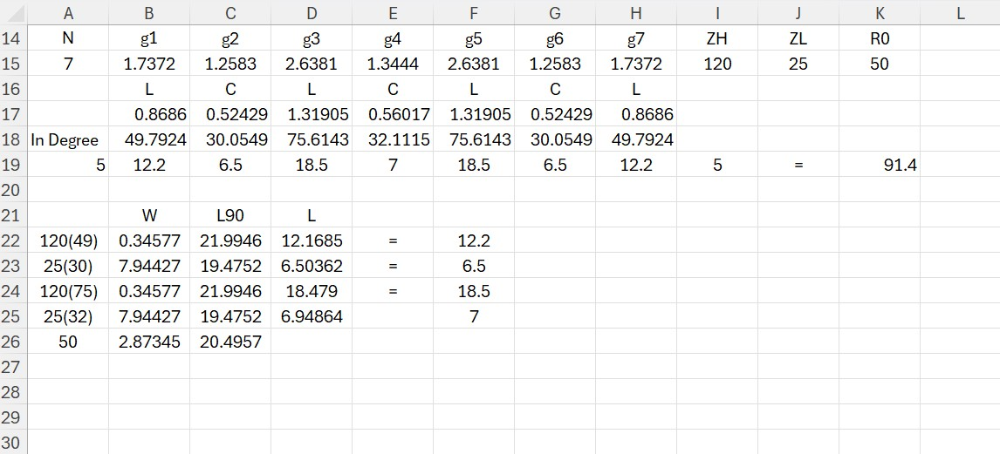

## Design Low Pass Filter

by using frequency cutoff at 2 GHz and attenuation 3 GHz > 30 dB.

#### We chosse 0.5 dB ripple Table

We get abs(W/Wc) - 1 = 0.5 and then we gonna get N = 7

#### Calculate L and C from g 7-order that we got from table in excel.

