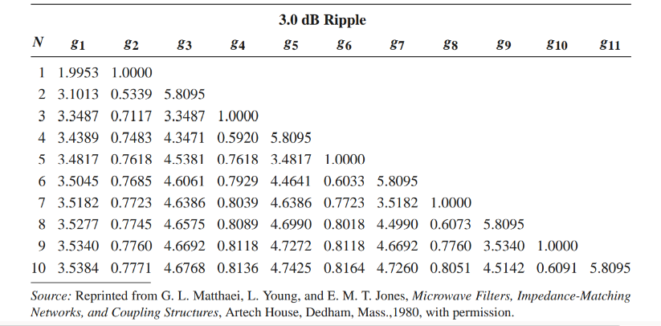
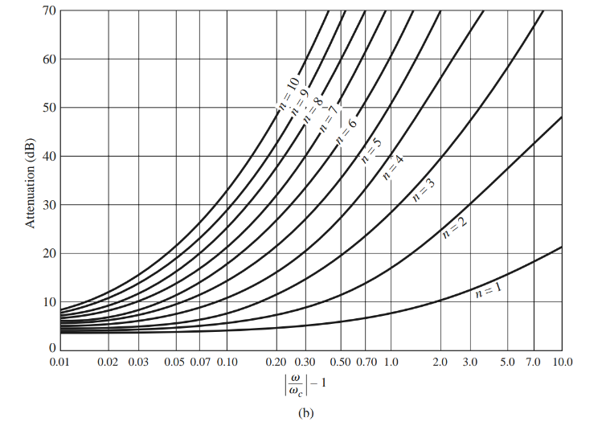
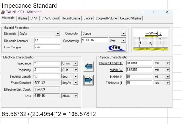
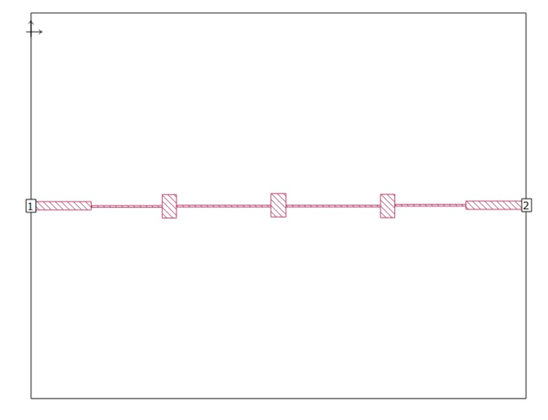
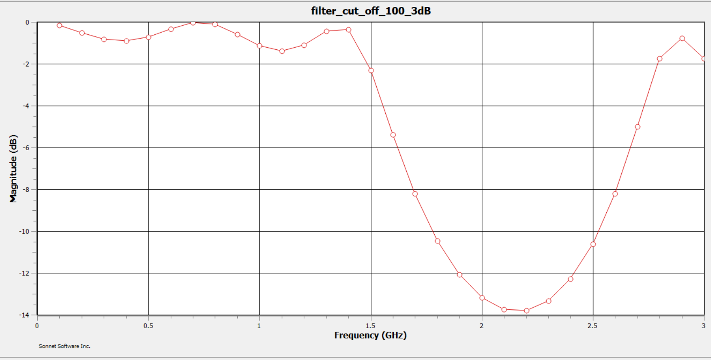
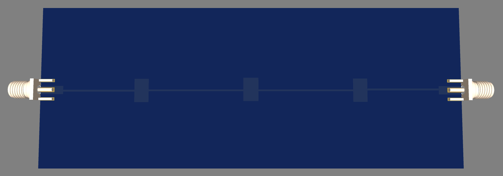

  

# Lab Report 
# On Transmission Line Filter Design
# Group Capybara group

### Submitted by

Theerasith	    Jakkhutip	6410554222 
Pusanisa	    Pukpasuk	6410554249 
Watcharaporn	Pupuang	    6410554265 
Suttiporn   	Pidkanpai	6410554273 

### Present to

Asst.Prof. Denchai Worasawate

Communication Architecture and Devices Laboratory 01205381  
section 450 Semester 2/2023 February 16, 2024

## Design a PCB LC Filter

#### Overview: The design process involves analysis of provided data and graphs to select appropriate values for designing LPF. 
#### Design Objective: Achieve maximum insertion loss (IL max) at 0–2.4 GHz (< 3 dB) and minimum rejection level (RJ min) at 4.8–6.0 GHz (>3 dB). Cut off 2GHz, ATTN 3GHz > 30dB

## Procedure

### 1. Using the data from this table (3.0 dB Ripple) to design STEPPED-IMPEDANCE LOW-PASS FILTER

### sampling at 100 ohms, we use at N=7

### 2. Take the Electrical Length, Impedance, and Frequency obtained from the calculations in Excel for a 7th order of 0.3 dB Ripple table , and use them to create components in the Sonnet program by determining the sizes from the TX line.

### Determine the sizes from TX line,

### Adding Load R ( Standard Load ) that connect into port1 and port2

### 3. Design the model in Sonnet by following the data that we calculate in TXline.

### 4. Then we will get the graph from the model as shown in the picture below.

### 5. When we have the desired graph, we then take the model through Sonnet to be drawn into EasyEDA in order to proceed with ordering the actual product.

## Conclusion

The design and implementation of a low-pass filter followed by the PCB layout using TxLine and EasyEDA, They have different results due to the error from the design. However the design of EasyEDA is also designed to be suitable for actual use.

EasyEda Link : [EASYEDA](https://oshwlab.com/theerasith.j/lamprang?fbclid=IwZXh0bgNhZW0CMTAAAR387q4szgnwZ0NF0JG5kuTK_cfKIYK3CuDeicDpgzNXSIQ5p4fzgamg_SY_aem_AQDtRsw-5LrENGr56v3BatLeCpTBndG0CcVJC7uE6muV3cDhYNcNJmHI_fXzOj6HAVVlILR5aRDT35N89ze6zEBx)
