

  

<h4 align="center">Transmission Lines Filter Design</h4>

<h4 align="center">YxBanpu Group</h4>

#### Members
1. Nattanan Anuwatkasem 6410554176
2. Akasuk Nithisboonglang 6410554290
3. Vorapol Cheewawutwatanawith 6410554257
4. Paramet Kitchanwit 6410551070

#### Present

Communication Architecture and Devices Laboratory 01205381
section 450 Semester 2/2023

## Step 1: Introduction to Low Pass Filters

Definition: Low Pass Filter (LPF) or High Cut is a frequency filter that allows low-frequency waves to pass through while cutting off higher-frequency waves.
Purpose: LPF filters sound within a frequency range, cutting off frequencies exceeding a defined threshold, commonly referred to as "High Cut."

## Step 2: Designing a Low Pass Filter

Overview: The design process involves analysis of provided data and graphs to select appropriate values for designing LPF.
Design Objective: Achieve maximum insertion loss (IL max) at 0–2.4 GHz (< 3 dB) and minimum rejection level (RJ min) at 4.8–6.0 GHz (>3 dB).
Cut off 2GHz, ATTN 3GHz > 30dB

#### 1.By using the data from this table to design STEPPED-IMPEDANCE LOW-PASS FILTER

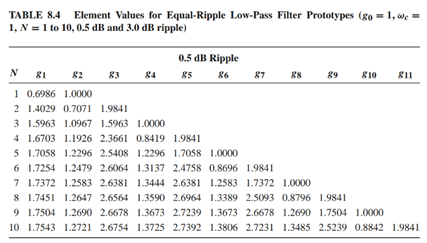

#### 2.We are choosing n = 9 from this graph

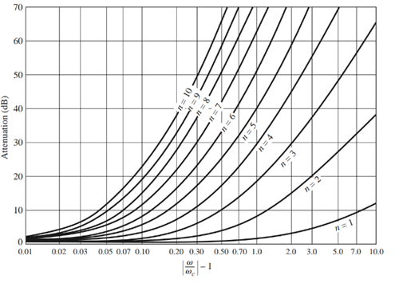

#### 3. From criteria given ATTN 3GHz > 30dB so from the graph above we are choosing n = 9 we will get (w/wc)-1 = 0.5 Calculation:

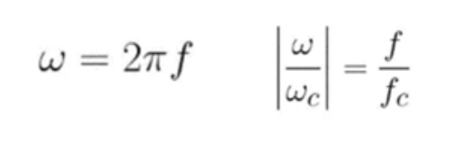 
 	f = 3 GHz, fc = 2 GHz, (w/wc) - 1 = 0.5

#### 4.Calculate g from the 1.) and 2.) to get the value to insert in the excel below to get the L and C value
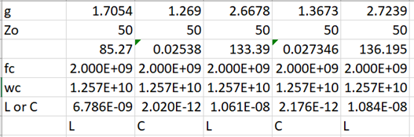

#### 5. Insert the data from above in sonnet to generate and get the lowpass graph below
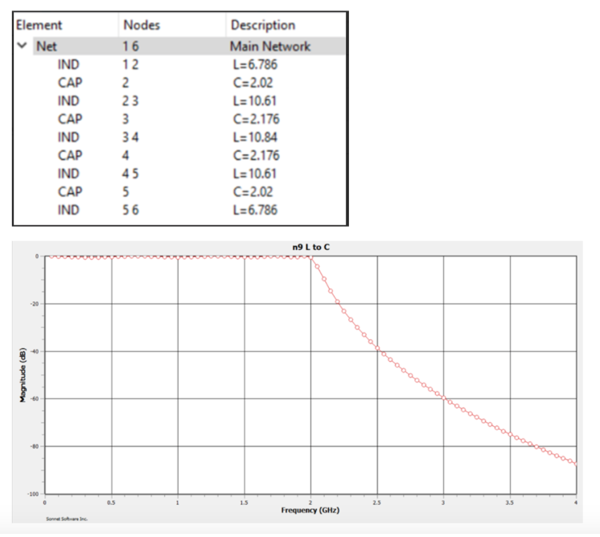

## Step 3: Evaluation of Cases  
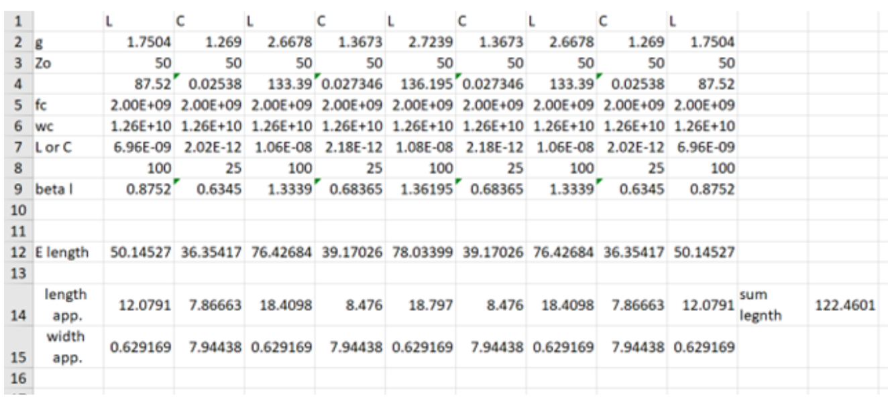

Use Excel to calculate the value to put in the transmission line

Analyze three cases using Sonnet software for visualization and comparison: 
Case 1: Zh=100Ω, Zl=25Ω 
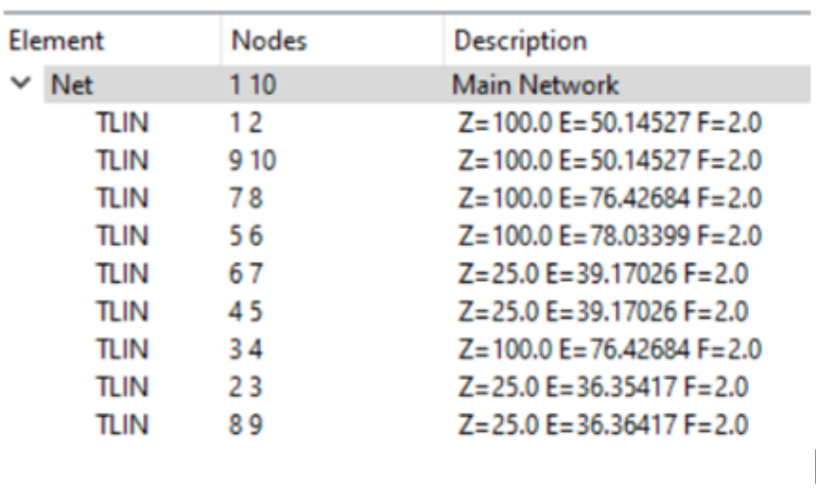

Case 2: Zh=200Ω, Zl=25Ω 
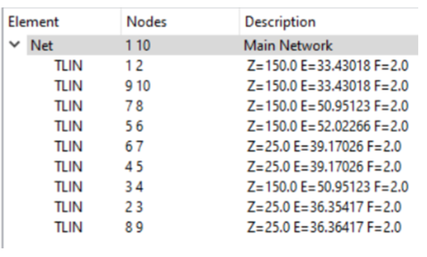
Case 3: Zh=150Ω, Zl=25Ω 

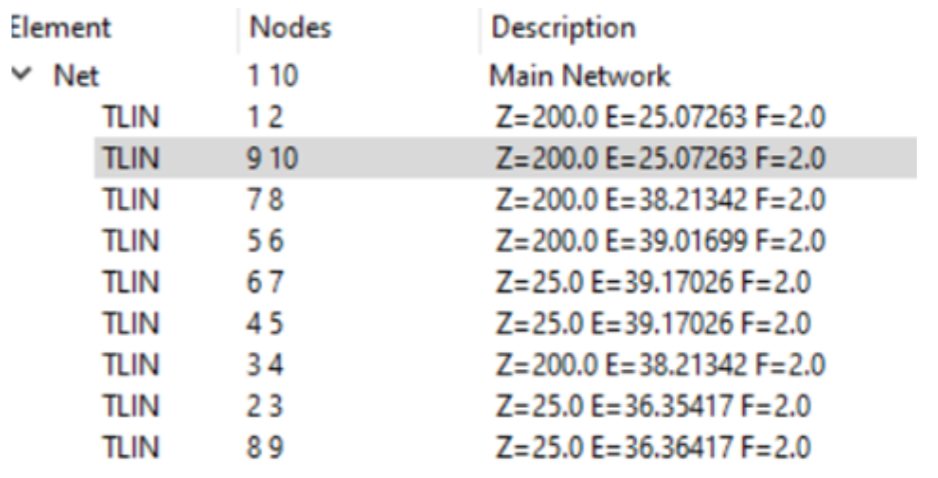

Compare Graph 
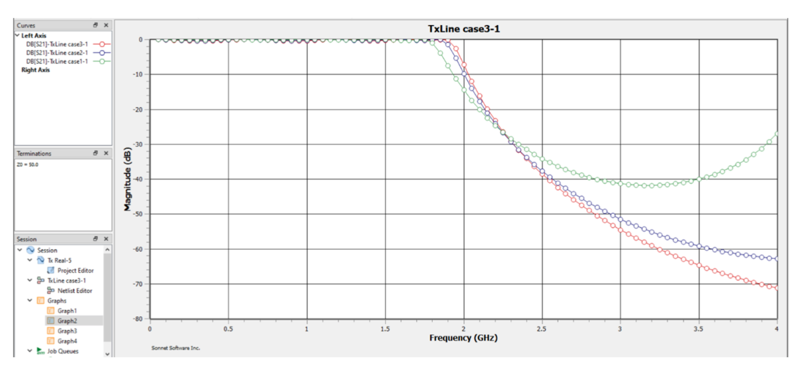

Compare cases at f = 2 GHz.
Consider practical implications alongside theoretical analysis.
Select the most suitable case (Case 1) for design.

## Step 4: compute and design

Use TxLine to compute PCB of board

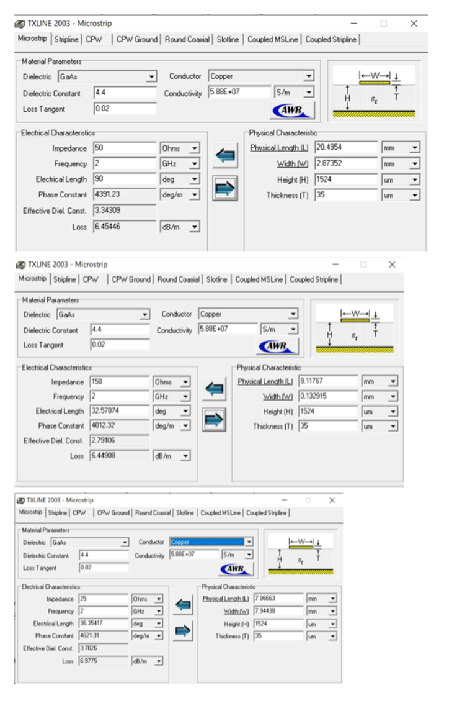

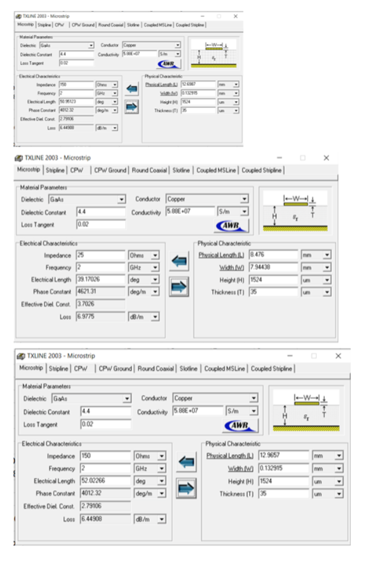

Design Geometry Sonnet

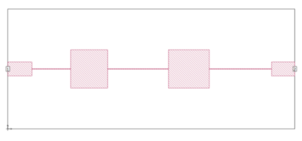

Graph from geometry

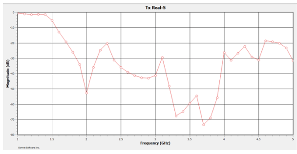

## Step 5: design PCB by using EasyEDA

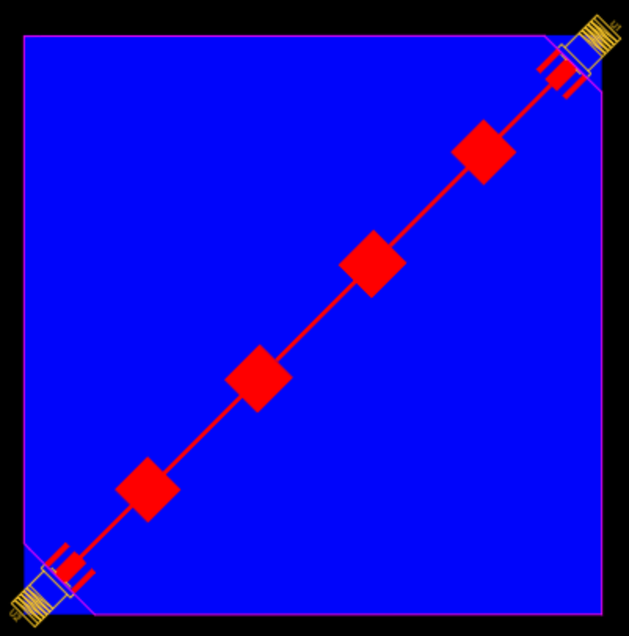

## Conclusion

From an experiment in Filter Design, starting with designing in the Sonnet program first, then designing in the EasyEDA program to order the real board. By experiment Values ​​obtained
from netlist simulation in the program It has a value similar to the geometry for which it was designed.  

EasyEda Link : [EASYEDA](https://oshwlab.com/akasuk.ni/pcb123456789)
